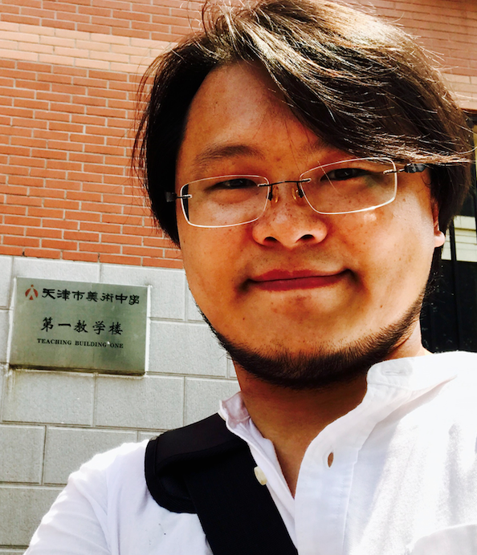

# 周连涛（周木）个人简历

> v3.0.1

[PDF版](docs/2017-08-03-周连涛简历-前端工程师.pdf)  \| [pages版](docs/2017-08-03-周连涛简历-前端工程师.pages)



我是周连涛，笔名周木，我更喜欢大家叫我木木或者 Moo。

我是一个内向性格的外向人，感性思考的理性人。会画点画做点设计，也会写点代码。偶尔有点与众不同，喜欢喝咖啡啤酒、听音乐、骑自行车，最最喜欢和孩子们在一起。

我目前在新华社新华网股份有限公司任前端组长、高级前端工程师和设计师职务。

* * *

## 个人特点

-   不安于现状，喜欢打破僵局，积极向上，默认正能量光环。
-   8年前端开发经验，4年前端团队管理经验。
-   5年平面设计，UI设计和交互设计经验，擅长漫画肖像手绘，熟悉视频剪辑摄影摄像。
-   熟练使用 GitHub 协同开发。
-   擅长前端动效现实、组件开发、代码调优，熟悉模块开发、前端工程化、ES6。
-   技术视野广阔、热爱技术分享，参与过nodejs开源贡献。
-   自学能力强，沟通能力出色，处事果断，雷厉风行。

[更多个人技能和技术特点](docs/skill.md)

* * *

## 作品展示

### 一些近期项目（2017-06-24 Update）

-   新华访谈
    [页面预览](http://www.xinhuanet.com/talking/)
    [Github 仓库地址](https://github.com/xinhuaRadioLAB/xinhuaTalking)
-   新华访谈-人物访谈
    [页面预览](http://news.xinhuanet.com/talking/character/2017040601.htm)
    [新华访谈-人物访谈项目前端开发介绍](https://xinhuaradiolab.github.io/xinhuaTalking-interview/)

## [绘画作品](https://cjmm.github.io/project-gallery/index.html#1)

## [开发项目](https://cjmm.github.io/project-gallery/index.html#2)

### _2016里约奥运会专题 中国强_

-   页面地址：<http://www.xinhuanet.com/sports/rio2016/zgq.htm>
-   预览图：[1](case/rio2016_cf1.png) [2](case/rio2016_cf2.png)
-   项目描述：新华网2016里约奥运会专题报道之一中国强专题，主要报道奥运期间奖牌活动情况。

### _新华网2016全国两会_

-   页面地址：<http://www.news.cn/politics/2016lh/>
-   预览图：[1](case/npc2016_1.png) [2](case/npc2016_2.png)
-   项目描述：新华网2016全国两会专题，全面报道2016年全国两会实况。

### _建党95周年专题_

-   页面地址：<http://www.news.cn/politics/jd95/index.htm>
-   预览图：[1](case/jd95.png)
-   项目描述：新华网纪念中国共产党建立95周年专题报道。

### _2015巴黎气候变化大会 新华网_

-   页面地址：<http://www.xinhuanet.com/world/bldh/>
-   预览图：[1](case/cop2015.png)

### _2015习近平主席和你一起许下新年愿望 新华网_

-   页面地址：<http://fms.news.cn/swf/xnyj/>
-   预览图：[1](case/xnyj0.png) [2](case/xnyj1.png) [3](case/xnyj2.png) [4］](case/xnyj3.png) [5](case/xnyj4.png) [6](case/xnyj5.png)

### _新华广播电台_

-   网站地址：<http://www.xinhuanet.com/video/xinhuaradio/>
-   预览图：[1](case/xhr.png)
-   项目时间：_2015.05 - 2015.06_
-   项目简介："也许有人要说，生活忙碌，来去匆匆，挤不出去时间看图、读文字、浏览视频怎么办？那么用耳朵听听"新华广播"是个不错的选择。无论是在购物网站逛街、还是在做饭、运动、挤地铁、甚至是在放松泡澡时，都可以使用"新华广播"，收听极速更新、无广告版的"绿色"新闻。"（摘自新华社"新华网2015全新改版专题"介绍相关文章）

### _情人节电子贺卡 for My Wife ❤️_

-   页面地址：<http://cjmm.github.io/love/>
-   项目描述：情人节电子贺卡

* * *

## **工作经历**

### _2014.10 - 至今_ 新华网股份有限公司 **（国内上市公司 ）**

公司描述： _新华网于1997年11月7日创办，依托新华社30多个国内分社和170个境外分支机构，组成了覆盖全球的新闻信息采集网络，中（简、繁）、英、法、俄、日、西、阿等7个语种和藏、维两个少数民族语言， 24小时不间断地全球发布新闻信息。经过十余年的创新发展，新华网实现了从单媒体到多媒体、从单语种到多语种、从有线到无线、单一新闻发布平台到多功能发布平台的跨越式发展。新华网2010年转企改制，实行公司化运作体制机制。目前新华网在努力奋进，向着建设符合现代全媒体业态要求的国际一流网络媒体、具有强大创新能力的新型互联网文化企业迈进。_

公司规模： _2000-3000_ 人

#### 主要职务：前端组长

-   所属下属：_17_ 人
-   工作地点：北京
-   所在部门：技术部 新华网网页创意设计室
-   汇报对象：COO／主任
-   工作职责：

    -   前端架构设计；
    -   前端工程师工作协同的分配和调度；
    -   评估前端工程师提交的代码质量及可用性、稳定性，并提出相应优化建议；
    -   web制作；
    -   web交互实现；
    -   js动效实现；
    -   基于html5、CSS3的交互动画；
    -   canvas动画和svg绘制；
    -   手机移动端 html5的web app开发；
    -   javascript编写及优化；
    -   SSI技术支持；

#### 其他职务：设计师

-   工作职责：

    -   web视觉设计；
    -   交互设计；
    -   手机app设计；
    -   动画动效设计；
    -   logo设计 ；

### _2004.11 - 2014.10_ 河北日报 燕赵都市报社 **(10年)**

公司描述：_燕赵都市报是蜚声业内的社会生活类报纸，自1996年创刊以来，始终实行"办报、广告、发行三位一体"运作的理念，坚持新闻立报、内容为王的宗旨，凭借"为市井人家办报，让平民百姓爱读"的"草根情结"，在燕赵大地树立了良好的美誉度和强大的影响力。发行量全国第级9位，世界第17位。_

公司规模： 1000 人

#### 主要职务：首席前端开发工程师 _(2008.11 - 2014.10) (6年)_

-   工作地点： 石家庄
-   所在部门： 技术中心
-   汇报对象： COO
-   下属人数： _4_
-   工作职责：

    -   网站及相关产品GUI设计工作；
    -   移动终端 GUI设计；
    -   web设计与网站架构设计；
    -   SEO搜索引擎优化；
    -   Javascript优化；
    -   整站html编写；
    -   样式表编写优化；
    -   对接后台发布系统；
    -   后台办公系统oa整体GUI设计；
    -   网站flash广告设计和动画制作；
    -   负责培训网络编辑；
    -   负责考核和招聘美工；
    -   统筹网站大规模改版升级；
    -   整体GUI风格的调整规划；

-   工作业绩：

    -   燕赵都市报和燕赵都市网荣获世界报业排行第17名、全国报业发行量排行第九名；
    -   燕赵都市网2008年首批建站技术人员；

#### 其他职务：美术编辑 _(2004.11 - 2008.12)_

-   工作地点：石家庄
-   所在部门：版式设计中心
-   汇报对象：设计总监
-   工作职责：

    -   出版物版式设计；
    -   出版物排版；
    -   插图绘制和设计；
    -   出版物模版设计；
    -   报纸、周刊及相关封面设计、策划、执行；

* * *

## 个人简介

### 首先从本职工作开始。

我有超过十年的工作经验。前端开发和设计占的时间基本平分，因为我的日常工作如此。2004 年在河北参加工作，做美术编辑和插画师 4 年，2008 年创建河北日报门户网站，开始前端开发和 web、UI 设计方面的工作，2014 年入职新华社新华网
，开始专注于前端开发和 JS 编码方向，所以介绍自己的时候，我经常要和别人解释我到底是设计师，还是程序员。

我擅长前端表现层和前端动画方面的开发，精通 Hype3 动画制作。尝试过一些前端架构方面工作，擅长 jQuery 使用及 jQuery 插件的开发。热爱 Github 开源项目。

我非常喜欢交互设计，平时的编码如果时间允许，我往往会在交互方面多一些关注，我会为了改善用户体验重构代码，因为我觉得这是值得的。我会平面设计，有自由设计者实战经验，因为有几年时间一直做自由设计者的工作糊口。

我热爱互联网分享精神，非常喜欢参加 hackathon 黑客马拉松活动。也经常参加线上、线下的技术开发者大会，比如这两年的 JavaScript 中国开发者大会，我都有参加。

对于编程技能，我一只认为他们都是很酷很好玩的东东。小的时候我们会因为专注一件事忘记吃饭
，虽然我早已不再是“小的时候”了，但我自认为还有着孩子那样真挚的专注力，所以对于新技术，这就是我的态度。

### 然后和生活、兴趣有关。

我喜欢画画，很幸运没有把她变成我的职业，所以我得到更多的创意上的自由空间。我会画点油画、CG数字绘画，我会画一些漫画人物肖像。

我爱所有的孩子，我有一个女儿，今年9岁，我爱她，她是我的骄傲。所以我对照顾小孩和读故事绘本很在行！我喜欢 Apple 产品、是漫画插画爱好者、是重度 Blizzard 粉丝、是不折不扣的 Bon Jovi 硬派摇滚爱好者，我还喜欢后摇和 Live house、喜欢喝咖啡和啤酒，偶尔会做点手冲咖啡。

* * *

我最喜欢 Bon Jovi "Save The World" 的一句歌词

```txt
"Save The World"

I never went to college
I don't have a degree
Let's say I went to night school
I learned all I know on the streets
I wasn't born a rich man
I ain't got no pedigree
The sweat on this old collar
That's my Ph.D.
```

翻译过来大概是这个意思：

> 我没有什么学位，我旧衣领上的汗水，就是我人生哲学的博士学位。

幸运的是我还是上过大学的。

## 教育经历

河北秦皇岛教育学院 美术教育专业 2002-2004 专科

## 最后用一段话总结自己：

我非常喜欢《礼记·大学》的一段话：

> “物格而后知至，知至而后意诚，意诚而后心正，心正而后身修，身修而后家齐，家齐而后国治，国治而后天下平。”

我愿意把自己作为我编写的一个程序，“审视”每一行代码，我正使用“正心、修身、齐家、治国而平天下”的底层实现，我执行阳明心学为我的编程规范，这个代码运行了30几年，有时他显然不够完美，有时有点“中西合璧”，相比大家有时有点“格格不入”。

更多的时候，他愿意想他所想，爱他所爱，发挥他全部的光和热，虽微微，但我仍然希望他能够照亮这个世界。

* * *

## 附录和链接

一些我的文章和博客

<https://github.com/xinhuaRadioLAB/blog/issues>

我的 Github

<https://github.com/superwoods>

个人网站

<http://cjmm.github.io>

* * *

-   这篇文章使用 Markdown 书写

Have fun 😊

Cheers! 🍻
